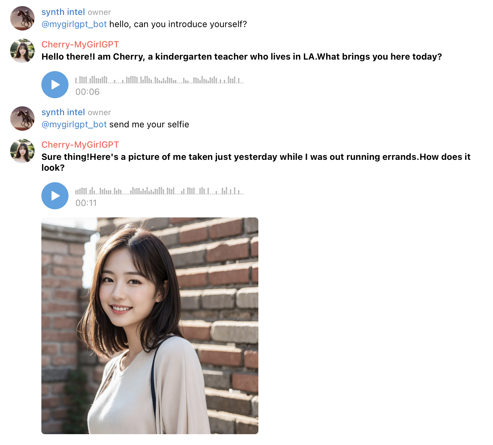

# MyGirlGPT - Your Personal AI Girlfriend Running on Your Personal Server

Welcome to the MyGirlGPT repository. This project allows you to build your personalized AI girlfriend with a unique personality, voice, and even selfies. The AI girlfriend runs on your personal server, giving you complete control and privacy.

## Demo
Click the image below to watch a demo:

## Subscribe to updates here: https://twitter.com/SynthIntel2023

## Public Telegram Bot
Join us on Telegram to chat with Cherry and be part of the MyGirlGPT community! Click [MyGirlGPTCommunity](https://t.me/MyGirlGPTCommunity) to join.

### How to use telegram bot
- In the group, use `@mygirlgpt_bot` to talk to Cherry. 
- Want to hear Cherry's voice? Just use the /voice command to switch it on or off.
- want a selfie? Just send  "send me a pic" or "send me your selfie", and it'll be on its way!

## Architecture

- TelegramBot
  - bot: Receive messages from Telegram, and send messages  to mygirl.
  - mygirl: Process the message and send it to the LLM Server. If text-to-speech conversion is required, call the TTS Server.
- LLM Server: As the brain of the AI girlfriend, generates reply messages. If it is determined that a message is required by the user, call the stable diffusion webui API to generate an image.
- TTS Server: Provide text-to-speech capabilities.
- text2img Server: Use stable diffusion webui API to provide text2img capabilities.

## Still working hard to release the code of LLM Server And TTS Server !!!

## Features
* Telegram Integration: Connect directly with your AI girlfriend through Telegram, allowing you to send and receive messages seamlessly.
* Local Large Language Model (LLM): Powered by [text-generation-webui](https://github.com/oobabooga/text-generation-webui) with better privacy protection.
* Personality Customization: Tailor the AI's personality to your preferences, making her a perfect match for you.
* Voice Generation: Utilize [Bark](https://github.com/suno-ai/bark) to generate a voice for your AI model, enhancing the immersive experience.
* Selfie Generation: Your AI girlfriend is capable of generating photorealistic selfies upon request, powered by [Stable Diffusion web UI](https://github.com/AUTOMATIC1111/stable-diffusion-webui).

## Roadmap
* Video Capability: Soon, your AI girlfriend will be able to send you videos of herself, further enriching the interaction.
* Discord Integration: Connect your AI girlfriend to Discord, expanding the platforms where you can interact with her.

## Contributing
We welcome pull requests. If you plan to make significant changes, please open an issue first to discuss them.

## License
This project is licensed under the MIT License.

## Powered by
- [Stable Diffusion web UI](https://github.com/AUTOMATIC1111/stable-diffusion-webui)
- [Bark](https://github.com/suno-ai/bark)
- [text-generation-webui](https://github.com/oobabooga/text-generation-webui)